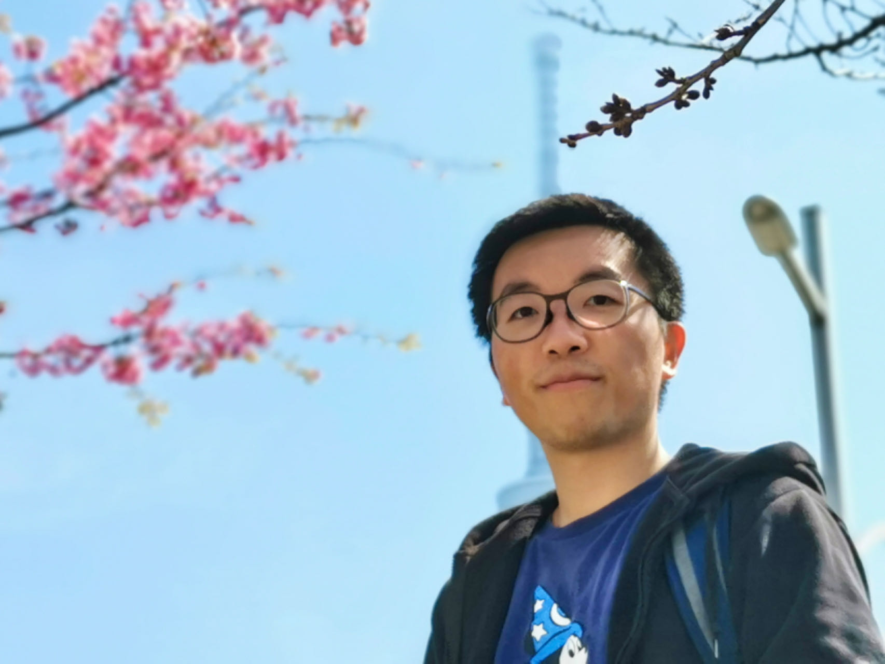

<table style="width:100%;border:0px;border-spacing:0px;border-collapse:separate;margin-right:auto;margin-left:auto;">
<tbody>
<tr style="padding:0px">
  <td style="padding:1% 1% 1% 0%;width:64%;vertical-align:middle">
    <h1>
      Zuoyue Li
    </h1>
    

      I am a PhD student in the <a href="https://cvg.ethz.ch">Computer Vision and Geometry (CVG)</a> group at <a href="https://ethz.ch/en.html">ETH Zurich</a>, 
      supervised by <a href="https://people.inf.ethz.ch/marc.pollefeys">Prof. Marc Pollefeys</a>. 
      My research interests focus on 3D vision and 3D generative models, and I collaborate closely with 
      <a href="https://people.inf.ethz.ch/moswald">Prof. Martin R. Oswald</a> and <a href="https://zhpcui.github.io">Prof. Zhaopeng Cui</a>.
    

    

      I am currently a research intern at Google Zürich.
      I was a research intern at Meta Zürich and was a visiting researcher at the University of Tokyo, supervised by Prof. Sato Yoichi.
    

    

      I obtained my M.Sc. degree with distinction in Computer Science at <a href="https://inf.ethz.ch">ETH Zurich</a>. 
      I completed my B.Eng. degree in Electronic and Information Engineering as an outstanding graduate at <a href="https://www.zju.edu.cn/english">Zhejiang University</a>. 
      I have received the Swiss Data Science Center (SDSC) fellowships, and Japan Society for the Promotion of Science (JSPS) fellowships.
    

    

      <a target="_blank" href="mailto:li.zuoyue@inf.ethz.ch"> Email</a> &nbsp;/&nbsp;
      <a href="https://github.com/lizuoyue">GitHub</a> &nbsp;/&nbsp;
      <a href="https://scholar.google.com/citations?user=UPH0tNgAAAAJ">Google Scholar</a> &nbsp;/&nbsp;
      <a href="https://www.linkedin.com/in/lizuoyue"> LinkedIn </a>
    

  </td>
  <td style="padding:1% 0% 1% 1%;width:36%;max-width:36%">
    
  </td>
</tr>
</tbody>
</table>

<!--with Dr. Kripasindhu Sarkar and Dr. Thabo Beeler.-->
<!--with Dr. Manuel López Antequera and Dr. Yubin Kuang.-->
<!--with a master's thesis supervised by Prof. Thomas Hoffman.-->

<table style="width:100%;border:0px;border-spacing:0px;border-collapse:separate;margin-right:auto;margin-left:auto;">
<tbody>
<tr style="padding:0px">  
  <h1>Research</h1>
</tr>
<tr>
  <td style="padding:1%;width:20%;vertical-align:middle">
    
  </td>
  <td style="padding:1%;width:80%;max-width:80%">
    
Project 1

  </td>
</tr>
<tr>
  <td style="padding:1%;width:20%;vertical-align:middle">
    
  </td>
  <td style="padding:1%;width:80%;max-width:80%">
    
Project 2

  </td>
</tr>
<tr>
  <td style="padding:1%;width:20%;vertical-align:middle">
    
  </td>
  <td style="padding:1%;width:80%;max-width:80%">
    
Project 3

  </td>
</tr>
<tr>
  <td style="padding:1%;width:20%;vertical-align:middle">
    
  </td>
  <td style="padding:1%;width:80%;max-width:80%">
    
Project 4

  </td>
</tr>
</tbody>
</table>

