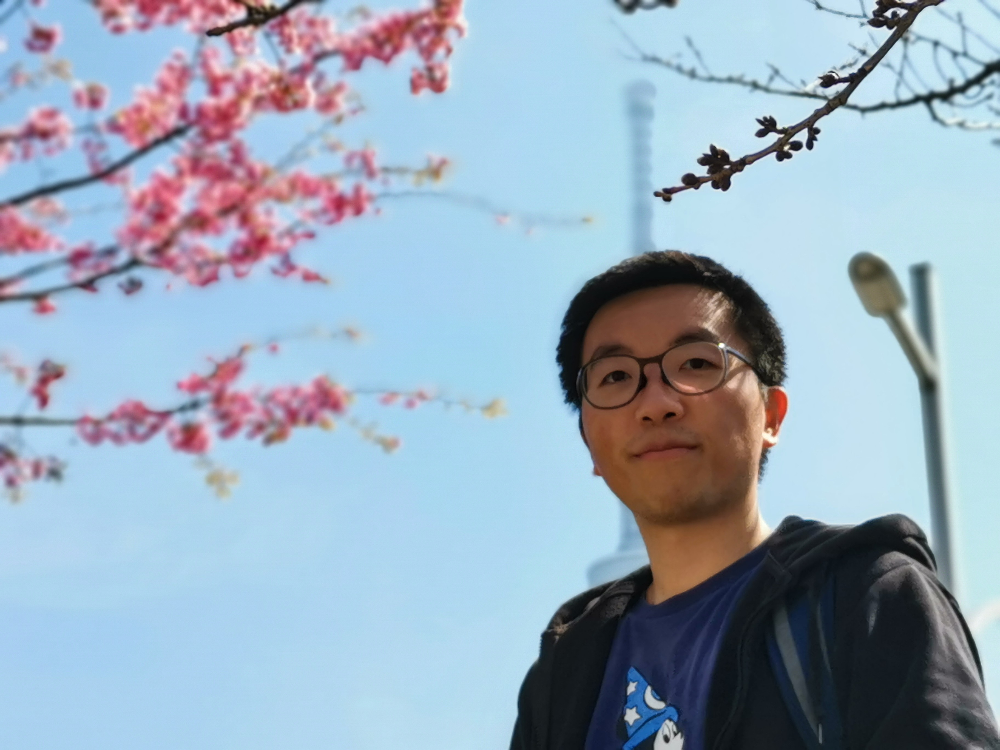

<table style="width:100%;border:0px;border-spacing:0px;border-collapse:separate;margin-right:auto;margin-left:auto;">
<tbody><tr style="padding:0px">
  <td style="padding:2.5%;width:60%;vertical-align:middle">
    <h1>
      Zuoyue Li
    </h1>
    
P1.

    
P2.

    
P3.

    

<!--       <a target="_blank" href="https://mailhide.io/e/B8TyS"> Email</a> &nbsp;/&nbsp; -->
       <a href="https://mailhide.io/e/wLub2pQH" onclick="popup=window.open('https://mailhide.io/e/wLub2pQH','mailhidepopup','width=580,height=635'); return false;">z......@gmail.com</a>
      <a href="https://github.com/lizuoyue">GitHub</a> &nbsp;/&nbsp;
      <a href="https://scholar.google.com/citations?user=UPH0tNgAAAAJ">Google Scholar</a> &nbsp;/&nbsp;
      <a href="https://www.linkedin.com/in/lizuoyue"> LinkedIn </a>
    

  </td>https://scholar.google.com/citations?user=
  <td style="padding:2.5%;width:40%;max-width:40%">
    
  </td>
</tr>
</tbody>
</table>

I am a PhD student at ETH Zürich, supervised by Prof. Marc Pollefeys.
My research interests focus on image/video synthesis and 3D generative models for scenes.
I collaborate closely with Prof. Martin R. Oswald and Prof. Zhaopeng Cui.

I am currently a research intern at Google Zürich. <!--with Dr. Kripasindhu Sarkar and Dr. Thabo Beeler.-->
I was a research intern at Meta Zürich, and <!-- with Dr. Manuel López Antequera and Dr. Yubin Kuang.-->
was a visiting researcher at the University of Tokyo, supervised by Prof. Sato Yoichi.

I obtained my M.Sc. degree with distinction in Computer Science at ETH Zürich. <!--with a master's thesis supervised by Prof. Thomas Hoffman.-->
I completed my B.Eng. degree in Electronic and Information Engineering as an outstanding graduate at Zhejiang University.

I have received the Swiss Data Science Center (SDSC) fellowships, and Japan Society for the Promotion of Science (JSPS) fellowships.
