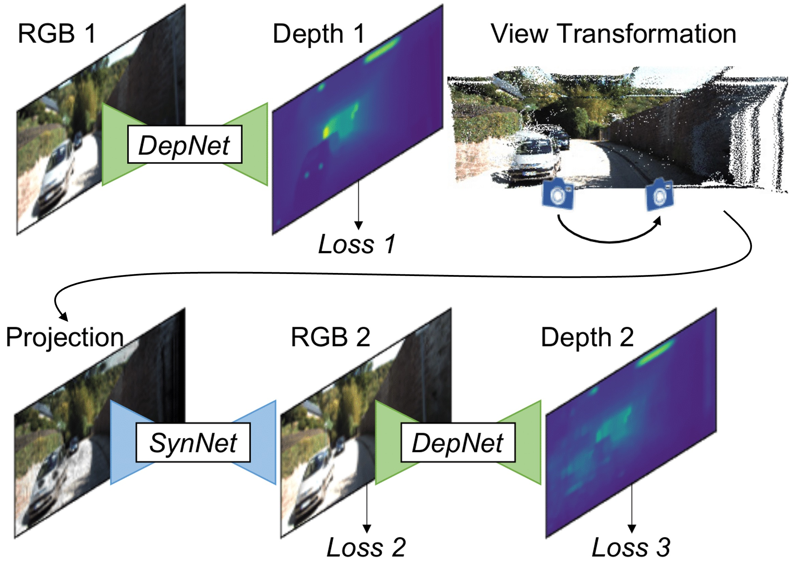
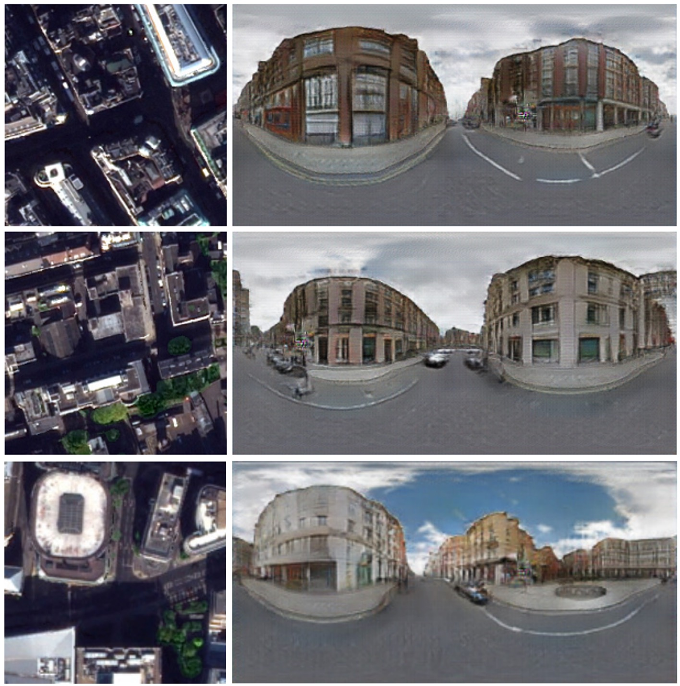

<table style="width:100%;border:0px;border-spacing:0px;border-collapse:separate;margin-right:auto;margin-left:auto;">
<tbody>
<tr style="padding:0px">
  <td style="padding:1% 1% 1% 0%;width:62%;vertical-align:middle">
    <h1>
      Zuoyue Li - 李 作越
    </h1>
    

      I am a PhD student in the <a target="_blank" href="https://cvg.ethz.ch">Computer Vision and Geometry (CVG)</a> group 
      at <a target="_blank" href="https://ethz.ch/en.html">ETH Zurich</a>, 
      supervised by <a target="_blank" href="https://people.inf.ethz.ch/marc.pollefeys">Prof. Marc Pollefeys</a>. 
      My research interests focus on 3D vision and 3D generative models, and I collaborate closely with 
      <a target="_blank" href="https://people.inf.ethz.ch/moswald">Prof. Martin R. Oswald</a> and <a target="_blank" href="https://zhpcui.github.io">Prof. Zhaopeng Cui</a>. 
      My doctoral research was mainly funded by the <a target="_blank" href="https://www.datascience.ch">Swiss Data Science Center (SDSC)</a> fellowships.　
    

    

      I am currently a research intern at <a target="_blank" href="https://research.google/locations/zurich">Google Zurich</a>
      with a topic on generative AI and digital humans. I was a research engineer intern at 
      <a target="_blank" href="https://www.metacareers.com/v2/locations/zurich">Meta Zurich</a> with a topic on 3D object detection, 
      and was an overseas researcher in the <a target="_blank" href="https://www.ut-vision.org/sato-lab">Computer Vision Group</a> at the 
      <a target="_blank" href="https://www.iis.u-tokyo.ac.jp/en">Institute of Industrial Science (IIS)</a>, 
      <a target="_blank" href="https://www.u-tokyo.ac.jp/en">The University of Tokyo</a> (東京大学), 
      supervised by <a target="_blank" href="https://sites.google.com/ut-vision.org/ysato">Prof. Yoichi Sato</a>, 
      funded by <a target="_blank" href="https://www.jsps.go.jp/english/e-fellow">Japan Society for the Promotion of Science (JSPS)</a> fellowships.　
    

    

      I obtained my M.Sc. degree in Computer Science with distinction at <a target="_blank" href="https://inf.ethz.ch">ETH Zurich</a>. 
      I completed my B.Eng. degree in Electronic and Information Engineering as an outstanding graduate at <a target="_blank" href="https://www.zju.edu.cn/english">Zhejiang University</a> (浙江大学).　
    

    

      <a target="_blank" href="mailto:li.zuoyue@inf.ethz.ch"> Email</a> &nbsp;/&nbsp;
      <a target="_blank" href="https://github.com/lizuoyue">GitHub</a> &nbsp;/&nbsp;
      <a target="_blank" href="https://scholar.google.com/citations?user=UPH0tNgAAAAJ">Google Scholar</a> &nbsp;/&nbsp;
      <a target="_blank" href="https://www.linkedin.com/in/lizuoyue"> LinkedIn </a>
    

  </td>
  <td style="padding:2% 0% 1% 1%;width:38%;max-width:38%">
    
  </td>
</tr>
</tbody>
</table>

<!--with Dr. Kripasindhu Sarkar and Dr. Thabo Beeler.-->
<!--with Dr. Manuel López Antequera and Dr. Yubin Kuang.-->
<!--with a master's thesis supervised by Prof. Thomas Hoffman.-->

<h1>Research</h1>
<table style="width:100%;border:0px;border-spacing:0px;border-collapse:separate;margin-right:auto;margin-left:auto;">
<tbody>
<!-- <tr style="padding:0px">  
  <h1>Research</h1>
</tr> -->
<tr onmouseout="sat2scene_stop()" onmouseover="sat2scene_start()">
  <td style="padding:1%;width:20%;max-width:20%;line-height:0;vertical-align:middle">
    <video id="sat2scene_video" style="width:100%;max-width:100%;left:5%;opacity:1" muted loop>
      <source src="assets/sat2scene.mp4" type="video/mp4">Your browser does not support the video tag.
    </video>
    
  </td>
  <td style="padding:1%;width:80%;max-width:80%">
    

      <strong>3D Urban Scene Generation from Satellite Images with Diffusion</strong>
       
        <strong>Zuoyue Li</strong>, 
        <a target="_blank" href="https://www.linkedin.com/in/zhenqiangli">Zhenqiang Li</a>, 
        <a target="_blank" href="https://zhpcui.github.io">Zhaopeng Cui</a>, 
        <a target="_blank" href="https://people.inf.ethz.ch/marc.pollefeys">Marc Pollefeys</a>, 
        <a target="_blank" href="https://people.inf.ethz.ch/moswald">Martin R. Oswald</a>. 
       
      arXiv, 2024 &nbsp;/&nbsp; 
      <a target="_blank" href="https://arxiv.org/abs/2401.10786">Paper</a>
    

    

      Generalize diffusion models to 3D sparse space and perform urban scene generation on a given or predicted geometry, followed by neural rendering techniques to render arbitrary views with excellence in both single-frame quality and inter-frame consistency.
    

  </td>
</tr>

<tr onmouseout="compnvs_stop()" onmouseover="compnvs_start()">
  <td style="padding:1%;width:20%;max-width:20%;vertical-align:middle">
    <video id="compnvs_video" style="width:100%;max-width:100%;left:5%;opacity:1" muted loop>
      <source src="assets/compnvs.mp4" type="video/mp4">Your browser does not support the video tag.
    </video>
    
  </td>
  <td style="padding:1%;width:80%;max-width:80%">
    

      <strong>CompNVS: Novel View Synthesis with Scene Completion</strong>
       
        <strong>Zuoyue Li</strong>, 
        <a target="_blank" href="https://scholar.google.com/citations?user=siv1RXUAAAAJ">Tianxing Fan</a>, 
        <a target="_blank" href="https://www.linkedin.com/in/zhenqiangli">Zhenqiang Li</a>, 
        <a target="_blank" href="https://zhpcui.github.io">Zhaopeng Cui</a>, 
        <a target="_blank" href="https://sites.google.com/ut-vision.org/ysato">Yoichi Sato</a>, 
        <a target="_blank" href="https://people.inf.ethz.ch/marc.pollefeys">Marc Pollefeys</a>, 
        <a target="_blank" href="https://people.inf.ethz.ch/moswald">Martin R. Oswald</a>. 
       
      ECCV 2022 &nbsp;/&nbsp; 
      <a target="_blank" href="https://www.ecva.net/papers/eccv_2022/papers_ECCV/papers/136610441.pdf">Paper</a>
    

    

      Synthesize novel views from RGB-D images with largely incomplete scene coverage. Perform generation on a sparse grid-based neural representation to complete unobserved scene parts. Extrapolate the missing area and render consistent photorealistic image sequences.
    

  </td>
</tr>

<tr onmouseout="acmmm_stop()" onmouseover="acmmm_start()">
  <td style="padding:1%;width:20%;max-width:20%;vertical-align:middle">
    <video id="acmmm_video" style="width:100%;max-width:100%;left:5%;opacity:1" muted loop>
      <source src="assets/acmmm.mp4" type="video/mp4">Your browser does not support the video tag.
    </video>
    
  </td>
  <td style="padding:1%;width:80%;max-width:80%">
    

      <strong>Factorized and Controllable Neural Re-rendering of Outdoor Scene for Photo Extrapolation</strong>
       
        <a target="_blank" href="https://github.com/BoMingZhao">Boming Zhao</a>, 
        <a target="_blank" href="https://ybbbbt.com">Bangbang Yang</a>, 
        <a target="_blank" href="https://zhenyangli.github.io">Zhenyang Li</a>, 
        <strong>Zuoyue Li</strong>, 
        <a target="_blank" href="http://www.cad.zju.edu.cn/home/gfzhang">Guofeng Zhang</a>, 
        <a target="_blank" href="https://www.wlu.ca/academics/faculties/faculty-of-science/faculty-profiles/jiashu-zhao/index.html">Jiashu Zhao</a>, 
        <a target="_blank" href="https://www.yindawei.com">Dawei Yin</a>, 
        <a target="_blank" href="https://zhpcui.github.io">Zhaopeng Cui</a>, 
        <a target="_blank" href="http://www.cad.zju.edu.cn/home/bao">Hujun Bao</a>. 
       
      ACM Multimedia 2022 (<strong>Oral</strong>) &nbsp;/&nbsp; 
      <a target="_blank" href="https://dl.acm.org/doi/abs/10.1145/3503161.3548125">Paper</a> <!-- &nbsp;/&nbsp; 
      <a target="_blank" href="https://zju3dv.github.io/neural_outdoor_rerender">Project page</a> -->
    

    

      Expand tourist photos from a narrow field of view to a wider one while maintaining a similar visual style. Propose factorized neural re-rendering model to produce photorealistic novel views from cluttered outdoor Internet photo collections, which enables applications such as controllable scene re-rendering, photo extrapolation, and 3D photo generation.
    

  </td>
</tr>

<tr>
  <td style="padding:1%;width:20%;max-width:20%;vertical-align:middle">
    
  </td>
  <td style="padding:1%;width:80%;max-width:80%">
    

      <strong>Sat2Vid: Street-view Panoramic Video Synthesis from a Single Satellite Image</strong>
       
        <strong>Zuoyue Li</strong>, 
        <a target="_blank" href="https://www.linkedin.com/in/zhenqiangli">Zhenqiang Li</a>, 
        <a target="_blank" href="https://zhpcui.github.io">Zhaopeng Cui</a>, 
        <a target="_blank" href="https://u.osu.edu/qin.324">Rongjun Qin</a>, 
        <a target="_blank" href="https://people.inf.ethz.ch/marc.pollefeys">Marc Pollefeys</a>, 
        <a target="_blank" href="https://people.inf.ethz.ch/moswald">Martin R. Oswald</a>. 
       
      ICCV 2021 &nbsp;/&nbsp; 
      <a target="_blank" href="https://openaccess.thecvf.com/content/ICCV2021/papers/Li_Sat2Vid_Street-View_Panoramic_Video_Synthesis_From_a_Single_Satellite_Image_ICCV_2021_paper.pdf">Paper</a>
       
      Some description.
    

  </td>
</tr>

<tr>
  <td style="padding:1%;width:20%;max-width:20%;vertical-align:middle">
    
  </td>
  <td style="padding:1%;width:80%;max-width:80%">
    

      <strong>NVS-MonoDepth: Improving Monocular Depth Prediction with Novel View Synthesis</strong>
       
        <a target="_blank" href="https://zuriabauer.com">Zuria Bauer</a>, 
        <strong>Zuoyue Li</strong>, 
        <a target="_blank" href="https://cvnet.cpd.ua.es/curriculum-breve/es/orts-escolano-sergio/7775">Sergio Orts Escolano</a>, 
        <a target="_blank" href="https://cvnet.cpd.ua.es/curriculum-breve/es/cazorla-quevedo-miguel-angel/18333">Miguel Cazorla</a>, 
        <a target="_blank" href="https://people.inf.ethz.ch/marc.pollefeys">Marc Pollefeys</a>, 
        <a target="_blank" href="https://people.inf.ethz.ch/moswald">Martin R. Oswald</a>. 
       
      3DV 2021 &nbsp;/&nbsp; 
      <a target="_blank" href="https://ieeexplore.ieee.org/document/9665820">Paper</a>
    

    

      Application of novel view synthesis to improve monocular depth estimation, with a wrapping scheme using the estimated depth to an additional viewpoint. The same depth network is applied to the synthesized view and provides another supervision.
    

  </td>
</tr>

<tr>
  <td style="padding:1%;width:20%;max-width:20%;vertical-align:middle">
    
  </td>
  <td style="padding:1%;width:80%;max-width:80%">
      

      <strong>Spatio-Temporal Perturbations for Video Attribution</strong>
       
        <a target="_blank" href="https://www.linkedin.com/in/zhenqiangli">Zhenqiang Li</a>, 
        <a target="_blank" href="https://wei-min.wang">Weimin Wang</a>, 
        <strong>Zuoyue Li</strong>, 
        <a target="_blank" href="https://hyf015.github.io">Yifei Huang</a>, 
        <a target="_blank" href="https://sites.google.com/ut-vision.org/ysato">Yoichi Sato</a>. 
       
      TCSVT 2021 &nbsp;/&nbsp; 
      <a target="_blank" href="https://ieeexplore.ieee.org/abstract/document/9435317">Paper</a>
       
      Some description.
    

  </td>
</tr>

<tr>
  <td style="padding:1%;width:20%;max-width:20%;vertical-align:middle">
    
  </td>
  <td style="padding:1%;width:80%;max-width:80%">
    

      <strong>Towards Visually Explaining Video Understanding Networks with Perturbation</strong>
       
        <a target="_blank" href="https://www.linkedin.com/in/zhenqiangli">Zhenqiang Li</a>, 
        <a target="_blank" href="https://wei-min.wang">Weimin Wang</a>, 
        <strong>Zuoyue Li</strong>, 
        <a target="_blank" href="https://hyf015.github.io">Yifei Huang</a>, 
        <a target="_blank" href="https://sites.google.com/ut-vision.org/ysato">Yoichi Sato</a>. 
       
      WACV 2021 &nbsp;/&nbsp; 
      <a target="_blank" href="https://openaccess.thecvf.com/content/WACV2021/papers/Li_Towards_Visually_Explaining_Video_Understanding_Networks_With_Perturbation_WACV_2021_paper.pdf">Paper</a>
       
      Some description.
    

  </td>
</tr>

<tr>
  <td style="padding:1%;width:20%;max-width:20%;vertical-align:middle">
    
  </td>
  <td style="padding:1%;width:80%;max-width:80%">
    

      <strong>Geometry-Aware Satellite-to-Ground Image Synthesis for Urban Areas</strong>
       
        <a target="_blank" href="https://xiaohulugo.github.io">Xiaohu Lu</a>*, 
        <strong>Zuoyue Li</strong>*, 
        <a target="_blank" href="https://zhpcui.github.io">Zhaopeng Cui</a>, 
        <a target="_blank" href="https://people.inf.ethz.ch/moswald">Martin R. Oswald</a>, 
        <a target="_blank" href="https://people.inf.ethz.ch/marc.pollefeys">Marc Pollefeys</a>, 
        <a target="_blank" href="https://u.osu.edu/qin.324">Rongjun Qin</a>. 
       
      *Equal contribution. CVPR 2020 &nbsp;/&nbsp; 
      <a target="_blank" href="https://openaccess.thecvf.com/content_CVPR_2020/papers/Lu_Geometry-Aware_Satellite-to-Ground_Image_Synthesis_for_Urban_Areas_CVPR_2020_paper.pdf">Paper</a>
    

    

      Generate panoramic street-view images that are geometrically consistent with a given satellite image via a GAN-based network with the proposed geo-transformation layer that retains the physical satellite-to-ground relation. The synthesized images retain well-articulated and authentic geometric shapes, as well as the texture richness of the street view in various scenarios.
    

  </td>
</tr>

<tr>
  <td style="padding:1%;width:20%;max-width:20%;vertical-align:middle">
    
  </td>
  <td style="padding:1%;width:80%;max-width:80%">
    

      <strong>Topological Map Extraction from Overhead Images</strong>
       
        <strong>Zuoyue Li</strong>, 
        <a target="_blank" href="https://www.ics.uzh.ch/en/research/research-groups/Jan-Dirk-Wegner.html">Jan Dirk Wegner</a>, 
        <a target="_blank" href="https://omls.dmi.unibas.ch/en/persons/aurelien-lucchi">Aurelien Lucchi</a>. 
       
      ICCV 2019 &nbsp;/&nbsp; 
      <a target="_blank" href="https://openaccess.thecvf.com/content_ICCV_2019/papers/Li_Topological_Map_Extraction_From_Overhead_Images_ICCV_2019_paper.pdf">Paper</a>
       
      Some description.
    

  </td>
</tr>
</tbody>
</table>

<h1>Awards</h1>

Outstanding Reviewer, <a target="_blank" href="https://cvpr2023.thecvf.com/Conferences/2023/OutstandingReviewers">CVPR 2023</a>
 
Outstanding Reviewer, <a target="_blank" href="https://eccv2022.ecva.net/program/outstanding-reviewers">ECCV 2022</a>
 
National Scholarship for Outstanding Students Abroad, 2022
 
<a target="_blank" href="https://www.jsps.go.jp/english/e-fellow/e-fellow-sp/outline_eth.html">Japan Society for the Promotion of Science (JSPS) Fellowships for Research in Japan</a>, 2020
 
<a target="_blank" href="https://www.datascience.ch/phd-fellows">Swiss Data Science Center (SDSC) Fellowship</a>, 2019
 
Graduate with Distinction (M.Sc.) at ETH Zürich, 2018
 
Second Runner-up (student teams) at Helvetic Coding Contest, 2017
 
Outstanding Graduates at Zhejiang University, 2015

<h1>Academic Service</h1>

<strong>Conference Reviewer</strong>: CVPR, ICCV, ECCV, NeurIPS, WACV.
 
<strong>Journal Reviewer</strong>: TPAMI, TGRS.

<h1>Teaching</h1>

<table style="width:100%;border:0px;border-spacing:0px;border-collapse:separate;margin-right:auto;margin-left:auto;">
<tbody>

<tr style="padding:0px">
  <td style="padding:0%;width:85%;vertical-align:middle">
    Teaching Assistant, <a target="_blank" href="https://www.vvz.ethz.ch/Vorlesungsverzeichnis/lerneinheit.view?lerneinheitId=178454&semkez=2024S&lang=en">252-0579-00L 3D Vision</a>, ETH Zürich
  </td>
  <td style="padding:0%;width:15%;max-width:15%;text-align:right">
    Spring 2024
  </td>
</tr>

<tr style="padding:0px">
  <td style="padding:0%;width:85%;vertical-align:middle">
    Teaching Assistant, <a target="_blank" href="https://www.vvz.ethz.ch/Vorlesungsverzeichnis/lerneinheit.view?lerneinheitId=173300&semkez=2023W&lang=en">263-5902-00L Computer Vision</a>, ETH Zürich
  </td>
  <td style="padding:0%;width:15%;max-width:15%;text-align:right">
    Autumn 2023
  </td>
</tr>

<tr style="padding:0px">
  <td style="padding:0%;width:85%;vertical-align:middle">
    Teaching Assistant, <a target="_blank" href="https://www.vvz.ethz.ch/Vorlesungsverzeichnis/lerneinheit.view?lerneinheitId=167257&semkez=2023S&lang=en">263-5904-00L Deep Learning for Computer Vision: Seminal Work</a>, ETH Zürich
  </td>
  <td style="padding:0%;width:15%;max-width:15%;text-align:right">
    Spring 2023
  </td>
</tr>

<tr style="padding:0px">
  <td style="padding:0%;width:85%;vertical-align:middle">
    Teaching Assistant, <a target="_blank" href="https://www.vorlesungen.ethz.ch/Vorlesungsverzeichnis/lerneinheit.view?semkez=2023S&lerneinheitId=168741&lang=en">252-0579-00L 3D Vision</a>, ETH Zürich
  </td>
  <td style="padding:0%;width:15%;max-width:15%;text-align:right">
    Spring 2023
  </td>
</tr>

<tr style="padding:0px">
  <td style="padding:0%;width:85%;vertical-align:middle">
    Teaching Assistant, <a target="_blank" href="https://www.vvz.ethz.ch/Vorlesungsverzeichnis/lerneinheit.view?lerneinheitId=162913&semkez=2022W&lang=en">252-0847-00L Computer Science</a>, ETH Zürich
  </td>
  <td style="padding:0%;width:15%;max-width:15%;text-align:right">
    Autumn 2022
  </td>
</tr>

<tr style="padding:0px">
  <td style="padding:0%;width:85%;vertical-align:middle">
    Teaching Assistant, <a target="_blank" href="https://www.vvz.ethz.ch/Vorlesungsverzeichnis/lerneinheit.view?lerneinheitId=157422&semkez=2022S&lang=en">263-5904-00L Deep Learning for Computer Vision: Seminal Work</a>, ETH Zürich
  </td>
  <td style="padding:0%;width:15%;max-width:15%;text-align:right">
    Spring 2022
  </td>
</tr>

<tr style="padding:0px">
  <td style="padding:0%;width:85%;vertical-align:middle">
    Teaching Assistant, <a target="_blank" href="https://www.vvz.ethz.ch/Vorlesungsverzeichnis/lerneinheit.view?semkez=2022S&lerneinheitId=158871&lang=en">252-0579-00L 3D Vision</a>, ETH Zürich
  </td>
  <td style="padding:0%;width:15%;max-width:15%;text-align:right">
    Spring 2022
  </td>
</tr>

<tr style="padding:0px">
  <td style="padding:0%;width:85%;vertical-align:middle">
    Teaching Assistant, <a target="_blank" href="https://www.vvz.ethz.ch/Vorlesungsverzeichnis/lerneinheit.view?semkez=2021S&lerneinheitId=150524&lang=en">252-0579-00L 3D Vision</a>, ETH Zürich
  </td>
  <td style="padding:0%;width:15%;max-width:15%;text-align:right">
    Spring 2021
  </td>
</tr>

<tr style="padding:0px">
  <td style="padding:0%;width:85%;vertical-align:middle">
    Teaching Assistant, <a target="_blank" href="https://www.vorlesungen.ethz.ch/Vorlesungsverzeichnis/lerneinheit.view?lerneinheitId=140478&semkez=2020W&lang=en">263-5902-00L Computer Vision</a>, ETH Zürich
  </td>
  <td style="padding:0%;width:15%;max-width:15%;text-align:right">
    Autumn 2020
  </td>
</tr>

<tr style="padding:0px">
  <td style="padding:0%;width:85%;vertical-align:middle">
    Teaching Assistant, <a target="_blank" href="https://www.vorlesungen.ethz.ch/Vorlesungsverzeichnis/lerneinheit.view?lerneinheitId=136431&semkez=2020S&lang=en">252-0579-00L 3D Vision</a>, ETH Zürich
  </td>
  <td style="padding:0%;width:15%;max-width:15%;text-align:right">
    Spring 2020
  </td>
</tr>

<tr style="padding:0px">
  <td style="padding:0%;width:85%;vertical-align:middle">
    Teaching Assistant, <a target="_blank" href="https://www.vvz.ethz.ch/Vorlesungsverzeichnis/lerneinheit.view?lerneinheitId=134908&semkez=2020S&lang=en">263-5904-00L Deep Learning for Computer Vision: Seminal Work</a>, ETH Zürich
  </td>
  <td style="padding:0%;width:15%;max-width:15%;text-align:right">
    Spring 2020
  </td>
</tr>

<tr style="padding:0px">
  <td style="padding:0%;width:85%;vertical-align:middle">
    Teaching Assistant, <a target="_blank" href="https://www.vvz.ethz.ch/Vorlesungsverzeichnis/lerneinheit.view?lerneinheitId=132284&semkez=2019W&lang=en">263-5902-00L Computer Vision</a>, ETH Zürich
  </td>
  <td style="padding:0%;width:15%;max-width:15%;text-align:right">
    Autumn 2019
  </td>
</tr>

<tr style="padding:0px">
  <td style="padding:0%;width:85%;vertical-align:middle">
    Teaching Assistant, <a target="_blank" href="https://www.vvz.ethz.ch/Vorlesungsverzeichnis/lerneinheit.view?lerneinheitId=128451&semkez=2019S&lang=en">252-0579-00L 3D Vision</a>, ETH Zürich
  </td>
  <td style="padding:0%;width:15%;max-width:15%;text-align:right">
    Spring 2019
  </td>
</tr>

<tr style="padding:0px">
  <td style="padding:0%;width:85%;vertical-align:middle">
    Teaching Assistant, <a target="_blank" href="https://www.vvz.ethz.ch/Vorlesungsverzeichnis/lerneinheit.view?lerneinheitId=126900&semkez=2019S&lang=en">263-5904-00L Deep Learning for Computer Vision: Seminal Work</a>, ETH Zürich
  </td>
  <td style="padding:0%;width:15%;max-width:15%;text-align:right">
    Spring 2019
  </td>
</tr>

</tbody>
</table>

<h1>Contact</h1>

<strong>Zuoyue Li</strong> 
CAB G 85.2 
Universitätstrasse 6 
8092 Zürich 
Switzerland

Last update: 21 Jan 2024

